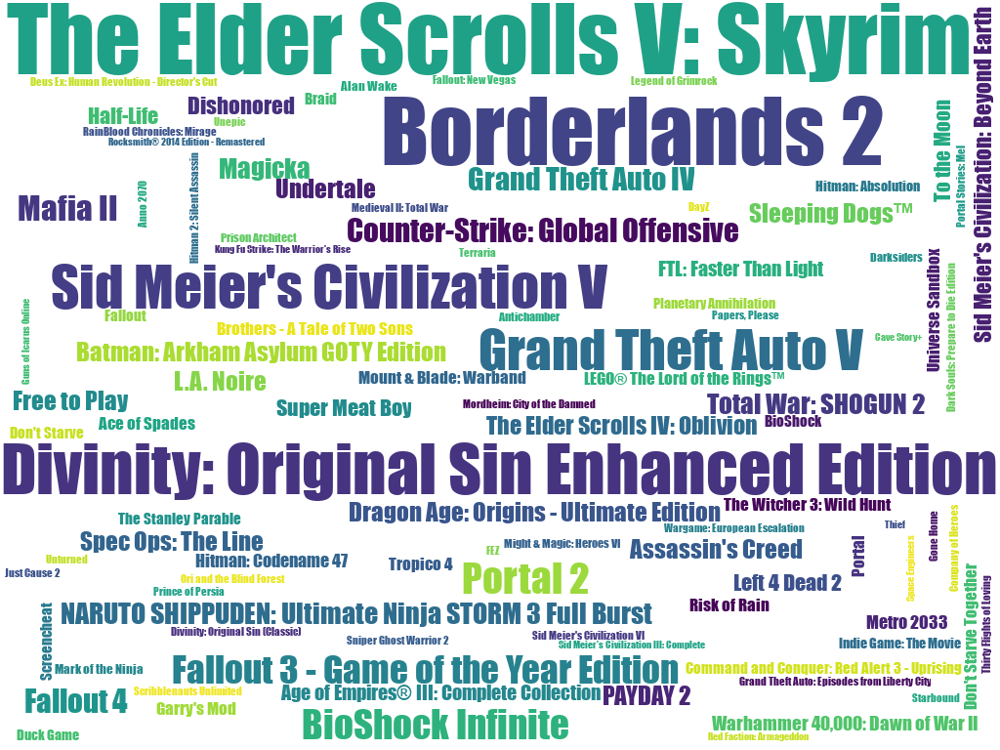

# steam-library-wordcloud
A wordcloud generate based on the playtime of games in your steam library

## Dependency
- Python3
- [word_cloud](https://github.com/amueller/word_cloud)
- [Requests](http://docs.python-requests.org/en/master/)

## Instruction
1. Clone the repo
2. Create a file called settings.py, add api_key and user_name variable. (See settings.py.example)
3. run `python3 main.py`

## Example
My wordcloud:

